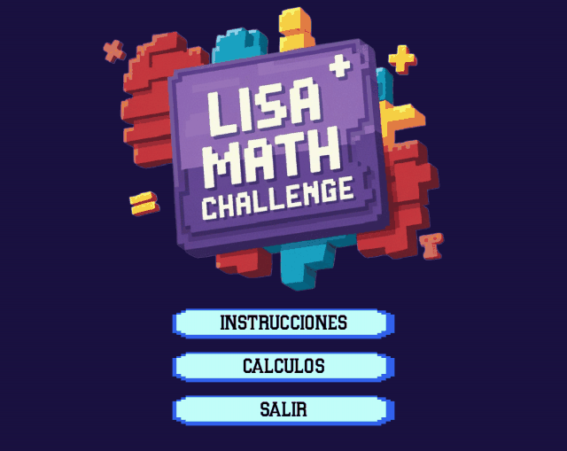
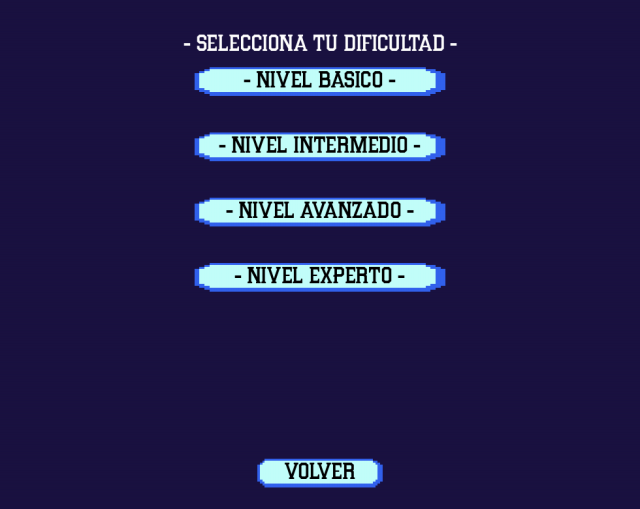
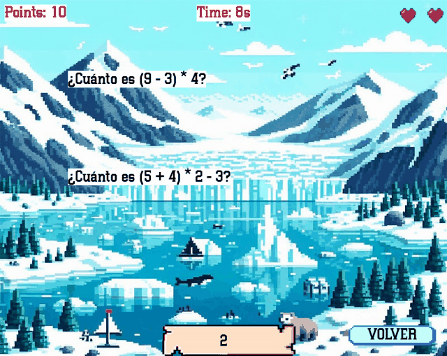
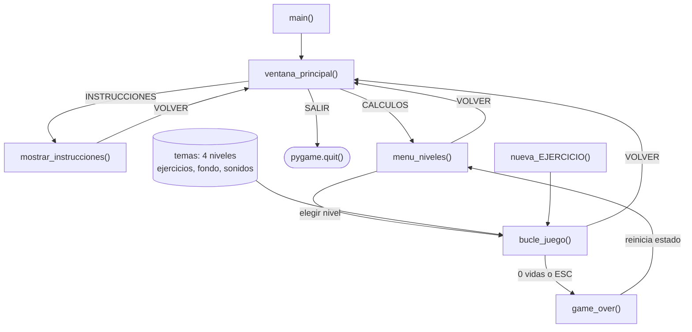

<div align="center">
  
  <h1>NumberDash</h1>
  <p><b>Juego de escritorio en pygame para practicar cálculo mental: escribe la respuesta antes de que la operación cruce la pantalla.</b></p>
  
  
  
  
  <p>
    <a href="#-inicio-rápido">Inicio rápido</a> ·
    <a href="#-características">Características</a> ·
    <a href="#-arquitectura">Arquitectura</a> ·
    <a href="#-pruebas">Pruebas</a> ·
    <a href="#-lo-que-todavía-no-existe">Limitaciones</a>
  </p>
</div>

NumberDash (título de ventana: *LISA MATH CHALLENGE*) es un juego de un solo archivo (`NumberDash.py`, ~720 líneas) hecho con pygame. Las operaciones aparecen a la izquierda y se desplazan hacia la derecha; el jugador teclea el resultado y, al coincidir, la operación desaparece (no hay tecla Enter). Es un proyecto educativo/de práctica: **no** tiene puntuaciones guardadas, multijugador ni instalador, y su banco de ejercicios contiene errores conocidos (ver [limitaciones](#-lo-que-todavía-no-existe)).

## 🎬 Vista rápida

<p align="center">
  
  
  
</p>

<sub>Capturas reales generadas con SDL en modo `dummy` (sin audio). En la de partida se fijó a mano la puntuación y el texto tecleado para mostrar varias operaciones a la vez.</sub>

## ✨ Características

| Característica | Detalle |
|---|---|
| Cuatro niveles | Básico (suma/resta/multiplicación/división), Intermedio (operaciones combinadas con paréntesis), Avanzado (fracciones) y Experto (potencias). 30 ejercicios por nivel, 120 en total. |
| Vidas | 3 vidas; se pierde una cada vez que una operación sale por el borde derecho sin ser respondida. |
| Dificultad progresiva | Aparece una operación más cada 8 puntos y la velocidad crece con la puntuación (`0.1 + puntos/50` px por frame). |
| Sin repetición inmediata | Evita repetir ninguna de las últimas 10 operaciones mostradas. |
| Entrada por teclado | Se compara lo escrito con la respuesta (sin distinguir mayúsculas y quitando espacios); acierta al instante, sin Enter. Retroceso borra. |
| Interfaz | Menú con logo animado, pantalla de instrucciones, fondo e imagen distintos por nivel, música por nivel y efectos de acierto/fallo/fin de juego. |
| Marcador | Puntos, tiempo transcurrido y corazones de vida en pantalla. |

## 🏗️ Arquitectura

Todo vive en `NumberDash.py`: datos (diccionario `temas`), estado global y una función por pantalla que ejecuta su propio bucle de eventos.



<details>
<summary>Estructura de carpetas</summary>

```text
NumberDash.py      # todo el juego
Font/              # tipografías .ttf (CollegeClean, Pixelletters)
Material/          # imágenes (.png/.jpg) y audio (.wav) de niveles y menú
docs/              # logo y capturas de este README
```

Los recursos se cargan con rutas relativas al propio script, así que se puede ejecutar desde cualquier directorio.
</details>

## 🚀 Inicio rápido

| Requisito | Versión |
|---|---|
| Python | 3.x (verificado con 3.14) |
| pygame | `pygame` o `pygame-ce` (verificado con pygame-ce 2.5.7) |

1. Clona el repositorio. Ojo: `Material/` pesa ~80 MB por los `.wav`.
   ```bash
   git clone https://github.com/Luiss2080/NumberDash.git
   cd NumberDash
   ```
2. Instala pygame (el repo no incluye `requirements.txt`).
   ```bash
   pip install pygame
   ```
3. Ejecuta el juego (necesita pantalla y dispositivo de audio; carga todos los `.wav` al arrancar).
   ```bash
   python NumberDash.py
   ```

Controles: clic en los botones del menú; en partida, teclado para la respuesta, `ESC` para abandonar (lleva a *Game Over*) y clic en **VOLVER** para regresar al menú.

> No pude comprobar el sonido ni jugar de forma interactiva; solo verifiqué que el juego arranca y renderiza sus pantallas en modo headless.

## 🧪 Pruebas

No hay pruebas automatizadas. Se hizo una revisión aparte de las 120 respuestas del banco de ejercicios evaluándolas con `fractions.Fraction`: **14 no coinciden con el resultado matemático** (detalle abajo).

## 🚧 Lo que todavía no existe

- **Respuestas incorrectas en el banco de ejercicios (14 de 120)**; quien responda correctamente no puntúa y pierde vidas. Ejemplos: `(8 + 3) * 2 - 5` figura como `21` (es 17); `(5/8) - (2/3)` como `1/24` (es −1/24); `(6/8) + (2/5)` como `19/20` (es 23/20); `2^5 + 3^3` como `41` (es 59); `6^2 / 2^3` como `9` (es 4,5). Afecta a los niveles intermedio, avanzado y experto.
- Las fracciones se comparan como texto: el nivel avanzado exige la forma exacta del banco, y algunas respuestas correctas no están simplificadas (`15/63`, `20/72`, `6/20`).
- Los ejercicios son fijos (listas escritas a mano); no se generan de forma aleatoria.
- Sin `requirements.txt`, sin instalador ni empaquetado, sin pruebas, sin CI.
- Sin guardado de puntuaciones ni récords. `VOLVER` desde la partida no reinicia puntos/vidas.
- Detalles del código: el clic de `VOLVER` sale del bucle con cualquier clic del ratón durante la partida; las pantallas se llaman unas a otras de forma recursiva; el texto de instrucciones habla de un "menú de pausa" que no existe.
- El repositorio arrastra ~80 MB de audio `.wav` sin comprimir, lo que hace lento el clonado.

## 📄 Licencia

Sin licencia definida: todos los derechos reservados por defecto.

<div align="center">
  <sub>Hecho por Luiss2080 · juego educativo de cálculo mental con pygame</sub>
</div>
